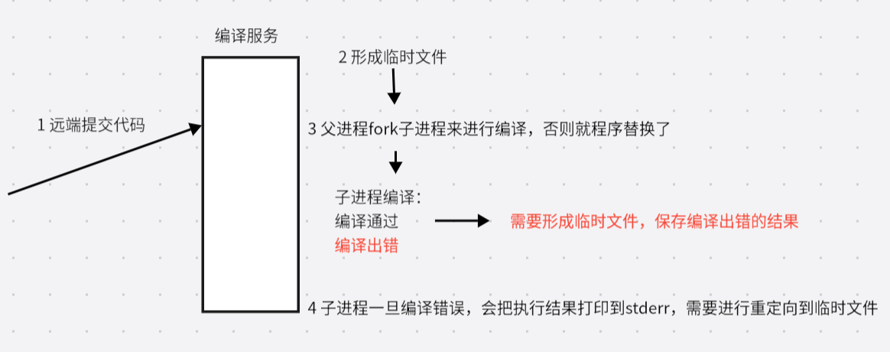
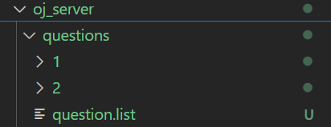
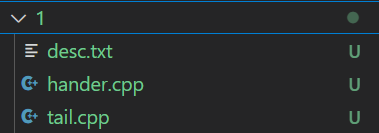
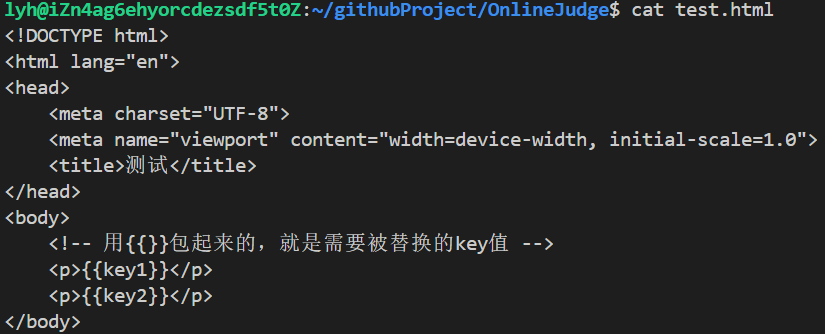
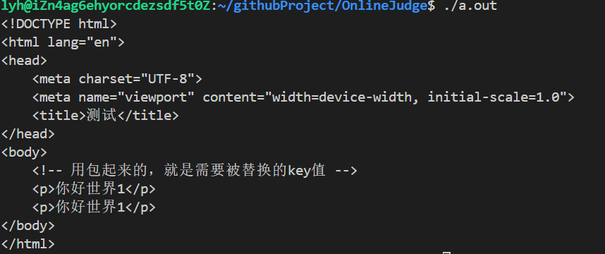

# 1 所用技术与开发环境

所用技术：

- c++ stl标准库
- Boost准标准库(字符串切割)
- cpp-httplib第三方开源网络库
- ctemplate第三方开源前端网页渲染库
- jsoncpp第三方开源序列化，反序列化库
- 负载均衡设计
- 多进程、多线程
- MySQL C connect
- Ace前端在线编辑器
- html/css/js/jquery/ajax

开发环境：

- Unbunto云服务器
- vscode

# 2 项目宏观结构

实现类似leetcode的题目列表+在线编程功能

项目核心是3个模块：

1 comm:公共模块

2 compile_serve r:编译与运行模块

3 oj_server: 获取题目列表，查看题目编写题目界面，负载均衡，其他功能


服务器会收到各种请求：

1 如果收到 请求题目列表或特定题目编写等请求，不需要对代码进行编译/提交，通过oj_server去访问后端数据库或文件，拉取对应的题目，返回给客户端；

2 如果用户要提交代码，oj_server就要负载均衡式的选择某一台后端主机进行编译，以网络形式提供编译服务，编译完成后把结果交给oj_server，由oj_server返回给客户端。

# 3 编写思路

1 先编写 compile_server

2 oj_server

3 版本1基于文件版的在线oj

4 前端的页面设计

5 版本2基于MySQL版的在线oj

# 4 compiler_server设计

提供的服务：编译并运行代码，得到格式化的相关结果



## 日志功能

```
//日志等级
enum{
    INFO,//常规   0
    DEBUG,//调试  1
    WARNING,//警告  2
    ERROR,//当前用户的请求发生错误 3
    FATAL//系统级错误 4
};
//LOG(INFO) << "message" << endl
inline static std::ostream& Log(const std::string &level,const std::string& fileName,int line)
{
    //添加日志等级
    std::string message = "[";
    message += level;
    message += "]";

    //添加报错文件名称
    message += "[";
    message += fileName;
    message += "]";

    //添加报错行
    message += "[";
    message += std::to_string(line);
    message += "]";

    //添加日志时间戳
    message += "[";
    message += TimeUtil::GetTimeStamp();
    message += "]";

    //cout内部本质是包含缓冲区的，所以要把刚刚的message写入到cout里
    std::cout << message;//不要endl进行刷新
    return std::cout;
}
//开放式日志
#define LOG(level) Log(#level,__FILE__,__LINE__)
```

## 编译功能

```c++
//引入路径拼接功能
using namespace ns_util;
using namespace ns_log;

//返回值：编译成功，true;否则false
//file_name:1234(传入只有文件名，没有后缀，手动拼接),因为在编译中会形成各种临时文件
//1234 -> ./temp/1234.cpp
//1234 -> ./temp/1234.exe
//1234 -> ./temp/1234.stderr 编译错误形成的文件
static bool Compile(const std::string &file_name)
{
     //首先创建子进程进行编译
    pid_t id = fork();
    if(id == 0)//子进程
    {
        int _stderr = open(PathUtil::Stderr(file_name).c_str(),O_CREAT|O_WRONLY,0644); 
        if(_stderr < 0)
        {
            LOG(WARNING) << "没有成功形成strerr文件"<<std::endl;
            exit(1);
        }
        //标准错误重定向到_stderr
        dup2(_stderr,2);
        //程序替换不会影响进程的文件描述符表

        //调用编译器，完成对代码的编译工作
        //g++ -o target src -std=c++11
        execlp("g++","g++","-o",PathUtil::Exe(file_name).c_str(),\
        PathUtil::Src(file_name).c_str(),"-std=c++11",nullptr);
        LOG(ERROR) << "启动编译器g++失败，参数错误？"<<std::endl;
        //程序替换失败，直接终止子进程
        exit(2);
    }
    else if(id > 0) //父进程
    {
        waitpid(id,nullptr,0);
        //编译是否成功
        //就看对应的.exe文件是否存在即可
        if(FileUtil::IsFileExists(PathUtil::Exe(file_name)))
        {
            LOG(INFO) << PathUtil::Src(file_name)<<"\n";
            LOG(INFO) << "编译成功" << "\n";
            return true;
        }
        LOG(INFO) << PathUtil::Src(file_name)<<"\n";
        LOG(INFO) << "编译失败,没有形成可执行程序"<<"\n";
        return false;
    }
    else//创建子进程失败
    {
        LOG(ERROR) << "编译模块创建子进程失败"<<std::endl;
        return false;
    }
}
```

## 运行功能

### 资源限制

用户的代码运行需要约束

使用setrlimit来限制进程的cpu运行时间和空间占用，一旦超过os会发送信号终止进程.

```
#include <iostream>
#include <sys/time.h>
#include <sys/resource.h>
#include <unistd.h>
#include <signal.h>
//没有做相关的资源约束，一直在死循环
// int main()
// {
//     while(1);
//     return 0;
// }

void handler(int signal)
{
    std::cout << "收到信号："<<signal << "\n";
    exit(1);
}
int main()
{
    //资源不足，导致os终止进程，是通过信号终止的 
    for(int i = 1; i <= 31; ++i)
    {
        signal(i,handler);
    }

    // //限制累计运行时长
    // struct rlimit r;
    // r.rlim_cur = 1;//最多1秒
    // r.rlim_max = RLIM_INFINITY;//硬上限设置为无穷大
    // setrlimit(RLIMIT_CPU,&r);//设置资源约束
    // while(1);
    
    //限制空间大小
    struct rlimit r;
    //注意：程序本身加载也会占用空间
    r.rlim_cur = 1024*1024*40;//40M
    r.rlim_max = RLIM_INFINITY;
    setrlimit(RLIMIT_AS,&r);
    int count = 0;
    while(true)
    {
        int* p = new int[1024*1024];//1M
        count++;
        std::cout << "申请空间：" << count << " M" << std::endl;
        sleep(1);
    }
    return 0;
}

//内存申请失败
terminate called after throwing an instance of 'std::bad_alloc'
  what():  std::bad_alloc
收到信号：6
kill -l
 1) SIGHUP       2) SIGINT       3) SIGQUIT      4) SIGILL       5) SIGTRAP
 6) SIGABRT      7) SIGBUS       8) SIGFPE       9) SIGKILL     10) SIGUSR1
11) SIGSEGV     12) SIGUSR2     13) SIGPIPE     14) SIGALRM     15) SIGTERM
16) SIGSTKFLT   17) SIGCHLD     18) SIGCONT     19) SIGSTOP     20) SIGTSTP
21) SIGTTIN     22) SIGTTOU     23) SIGURG      24) SIGXCPU     25) SIGXFSZ
26) SIGVTALRM   27) SIGPROF     28) SIGWINCH    29) SIGIO       30) SIGPWR
31) SIGSYS

//CPU使用超时
./a.out
收到信号：24

//设置进程占用资源大小的接口
static void SetProcLimit(int cpu_limit,int mem_limit)
{
    //设置CPU时长
    struct rlimit cpu_rlimit;
    cpu_rlimit.rlim_cur = cpu_limit;
    cpu_rlimit.rlim_max = RLIM_INFINITY;
    setrlimit(RLIMIT_CPU,&cpu_rlimit);

    //设置内存大小  mem_limit KB
    struct rlimit mem_rlimit;
    mem_rlimit.rlim_cur = mem_limit * 1024;//它本身是以byte为单位，所以要*1024转换成KB
    mem_rlimit.rlim_max = RLIM_INFINITY;
    setrlimit(RLIMIT_AS,&mem_rlimit);
}
```

### 完整实现

```
//指名文件名，不需要带路径和后缀
//0：表示程序正常运行完成，没有发生异常
//>0：表示程序运行时收到了信号，程序异常,
//<0:内部错误
//cpu_limit:该程序运行时，可以使用的最大cpu资源上限
//mem_limit:该程序运行时，可以使用的最大内存大小(KB)
static int Run(const std::string&file_name, int cpu_limit,int mem_limit)
{
    /*
    程序运行：
    1 代码跑完，结果 正确/不正确
    2 代码没跑完，中途收到信号退出
    */
   /*
        Run只需要考虑是否运行完毕
        结果正确与否，是由测试用例决定
   */

    /*
    一个程序在默认启动时：
    标准输入：不处理
    标准输出：程序运行完成，输出的内容
    标准错误：运行时错误信息
    */
    umask(0);
    int stdin_fd = open(PathUtil::Stdin(file_name).c_str(),O_CREAT|O_RDONLY,0644);
    int stdout_fd = open(PathUtil::Stdout(file_name).c_str(),O_CREAT|O_WRONLY,0644);
    int stderr_fd = open(PathUtil::Stderr(file_name).c_str(),O_CREAT|O_WRONLY,0644);
    if(stdin_fd < 0 || stdout_fd < 0 || stderr_fd < 0)
    {
        LOG(ERROR) << "运行时，打开标准文件失败" << std::endl;
        return -1;
    }
    pid_t id = fork();
    if(id < 0)
    {
        close(stdin_fd);
        close(stdout_fd);
        close(stderr_fd);
        LOG(ERROR) << "运行时创建子进程失败" << std::endl;
        return -2;
    }
    else if(id == 0)//子进程
    {
        //int setrlimit(int resource,const struct rlimit* rlim)设置一个进程占用资源的上限
        //第一个参数
        //RLIMIT_AS:占的虚拟内存大小
        //RLIMIT_CPU:占用的cpu时间
        //第二个参数
        /*
            struct rlimit{
                rlim_t rlim_cur;//约束占用资源的上限
                rlim_t rlim_max;//设置rlim_cur的最大值,默认无穷大
            };
        */
        //给子进程添加资源约束，子进程的资源使用情况将以信号方式向父进程呈现,资源越界就会返回特定信号
        //把程序运行的标准输入、输出、错误重定向到临时文件中
        dup2(stdin_fd,0);
        dup2(stdout_fd,1);
        dup2(stderr_fd,2);
        //设置进程资源限制(运行时长和空间占用)，内部封装setrlimit
        SetProcLimit(cpu_limit,mem_limit);
        execl(PathUtil::Exe(file_name).c_str(),PathUtil::Exe(file_name).c_str(),nullptr);
        exit(1);
    }
    else if(id > 0)//父进程
    {
        close(stdin_fd);
        close(stdout_fd);
        close(stderr_fd);
        int ret = 0;
        waitpid(id,&ret,0);
        //最后面7位代表收到的信号，0表示没有收到信号
        LOG(INFO) << "运行完毕，info:" << (ret & 0x7f) << std::endl;
        //通过判断信号，可以得知因为什么原因出错
        return ret & 0x7f;
    }
}
```

## 编译并运行整合

### 当前模块软件结构


### 认识jsoncpp

```c++
// 2 g++ test.cc -std=c++11 -ljsoncpp 要链接json库
//apt-get install libjsoncpp-dev
int main()
{ 
    //序列化工作
    //将结构化的数据，转换成一个字符串
    //Value是一个Json的中间类，可以填充KV值
    Json::Value root;
    root["code"] = "mycode"; 
    root["user"] = "李勇豪";
    root["age"] = "18";

    //用来进行序列化工作的类对象
    //Json::StyledWriter writer;
    //Json::FastWriter writer; 中文会乱码
    Json::StreamWriterBuilder writer;
    writer.settings_["emitUTF8"] = true;
    std::string str = Json::writeString(writer,root);
    std::cout << str << "\n";
    return 0;
}

{
        "age" : "18",
        "code" : "mycode",
        "user" : "李勇豪"
}
```

### 清理临时文件

在编译运行用户代码的过程中，会产生许多临时文件，在获取用户代码运行/编译结果时，应该清理掉

```
//把结果全部拿到以后，清理所有相关临时文件
FileUtil::RemoveTempFile(file_name);

//删除所有与file_name相关的临时文件
static void RemoveTempFile(const std::string& file_name)
{
    //清理文件的个数不确定
    //逐个判断
    std::string src = PathUtil::Src(file_name);
    if(FileUtil::IsFileExists(src)) 
        unlink(src.c_str());

    std::string compiler_error = PathUtil::CompilerError(file_name);
    if(FileUtil::IsFileExists(compiler_error)) 
        unlink(compiler_error.c_str());

    std::string execute = PathUtil::Exe(file_name);
    if(FileUtil::IsFileExists(execute))
        unlink(execute.c_str());

    std::string _stdin = PathUtil::Stdin(file_name);
    if(FileUtil::IsFileExists(_stdin))
        unlink(_stdin.c_str());

    std::string _stdout = PathUtil::Stdout(file_name);
    if(FileUtil::IsFileExists(_stdout))
        unlink(_stdout.c_str());

    std::string _stderr = PathUtil::Stderr(file_name);
    if(FileUtil::IsFileExists(_stderr))
        unlink(_stderr.c_str());
}
```

### 完整实现

```c++
//1 适配用户请求,定制通信协议字段
//2 正确调用compile and run
//3 形成唯一文件名 —— 编译服务随时可能被多个人请求，必须保证传递上来的code，形成源文件名称的时候，要具有唯一性，不然多个用户之间，会互相影响
#pragma once
#include "compiler.hpp"
#include "runner.hpp"
#include <jsoncpp/json/json.h>
#include "../comm/log.hpp"
#include "../comm/util.hpp"
//整合，在内部即调用compile.hpp 也调用 runner.hpp
namespace ns_compile_and_run
{
    using namespace ns_log;
    using namespace ns_util;
    using namespace ns_compiler;
    using namespace ns_runner;
    class CompileAndRun
    {
    public:
        //code > 0 进程收到信号导致进程退出/运行时报错
        //code < 0 非运行的报错(代码为空/编译报错/内部错误)
        //code = 0 成功
        static std::string CodeDesc(int code,const std::string& file_name)
        {
            std::string desc;
            switch(code)
            {
            case 0:
                desc = "编译运行成功";
                break;
            case -1:
                desc = "代码为空";
                break;
            case -2:
                desc = "未知错误/内部错误";
                break;
            case -3:
                //desc = "编译发生错误";
                FileUtil::ReadFile(PathUtil::CompilerError(file_name),&desc,true);
                break;
            case SIGABRT://6
                desc = "空间复杂度过高";
                break;
            case SIGXCPU://24
                desc = "时间复杂度过高";
                break;
            case SIGFPE://8
                desc = "浮点数溢出/除0错误";
                break;
            default:
                desc = "收到信号：" + std::to_string(code);
                break;
            }
            return desc;
        }
        /*
        json字符串里的key
        输入：
        code: 用户提交的代码
        input:用户给自己提交的代码对应的输入,方便扩展
        cpu_limit:时间要求   单位s
        mem_limit:空间要求   单位KB
        
        输出：
        必填字段
        status：状态码 0表示成功 <0发生错误
        reason：请求结果
        选填字段
        stdout：用户代码运行完的结果
        stderr：用户代码运行完的错误结果

        参数：
        in_json: {"code":"","input":"","cpu_limit":1,"mem_limit":1024}
        
        out_json:{"status":"0","reason":"运行未发生错误","stdout":"...","stderr":"..."}

        */
    static void Start(const std::string& in_json, std::string *out_json)
    {
        //反序列化：将1个字符串解析成多个kv值
        Json::Value in_value;
        Json::Reader reader;
        reader.parse(in_json,in_value);

        std::string code = in_value["code"].asString();
        std::string input = in_value["input"].asString();
        int cpu_limit = in_value["cpu_limit"].asInt();
        int mem_limit = in_value["mem_limit"].asInt();

        int status_code = 0;
        Json::Value out_value;
        std::string file_name;//形成的唯一文件名
        int run_code = 0; //代码运行的返回值

        //在goto 和 END 之间不能存在定义
        if(code.size() == 0)
        {
            status_code = -1;//代码为空
            goto END;
        }
        file_name = FileUtil::UniqFileName();
        if(!FileUtil::WriteFile(PathUtil::Src(file_name),code))
        {
            status_code = -2;//未知错误/内部错误
            goto END;
        } 

        if(!Compiler::Compile(file_name))
        {
            status_code = -3;//编译失败
            goto END;
        }
        run_code = Runner::Run(file_name,cpu_limit,mem_limit);
        if(run_code < 0)
        {
            status_code = -2;//未知错误/内部错误
        }
        else if(run_code > 0)
        {
            //程序运行崩溃，收到信号
            status_code = run_code;
        }
        else
        {
            //运行成功
            status_code = 0;
        }
    END:
        out_value["status"] = status_code;
        out_value["reason"] = CodeDesc(status_code,file_name);
        if(status_code == 0)
        {
            std::string std_out;
            std::string std_err;
            FileUtil::ReadFile(PathUtil::Stdout(file_name),&std_out,true);
            FileUtil::ReadFile(PathUtil::Stderr(file_name),&std_err,true);
            //整个过程全部成功，才需要填充stdout
            out_value["stdout"] = std_out;
            out_value["stderr"] = std_err;
        }
        //反序列化
        Json::StreamWriterBuilder writer;
        writer.settings_["emitUTF8"] = true;
        *out_json = Json::writeString(writer,out_value);
        //把结果全部拿到以后，清理所有相关临时文件
        FileUtil::RemoveTempFile(file_name);
    }
};
```

测试：

```
int main()
{
    // testCompile("code");
    // testExecute("code");

    //通过http 让client给我们上传一个json string数据
    std::string in_json;
    Json::Value in_value;
    //in_value["code"] = "#include<iostream> \n int main(){\n std::cout<<\"你好\"<<std::endl \n return 0;}";
    //R"()",raw string,在括号里的字符串，如果出现特殊字符，保持原貌
    in_value["code"] = R"(#include<iostream>
    int main()
    {
        std::cout<<"你好"<<std::endl; 
        aaaaaa
        return 0;
    })";
    in_value["input"] = "";
    in_value["cpu_limit"] = 1;
    in_value["mem_limit"] = 1024 * 100;//单位是KB，所以空间大小为100M
    
    Json::StreamWriterBuilder writer;
    writer.settings_["emitUTF8"] = true;

    in_json = Json::writeString(writer,in_value);
    

    std::string out_json;//将来给客户端浏览器返回的字符串
    CompileAndRun::Start(in_json,&out_json);

    std::cout << out_json << std::endl;
    return 0;
}

[INFO][compiler.hpp][61][1740224530]./temp/1740224530359xx0.cpp
[INFO][compiler.hpp][62][1740224530]编译失败,没有形成可执行程序
{
        "reason" : "./temp/1740224530359xx0.cpp: In function ‘int main()’:\n./temp/1740224530359xx0.cpp:5:9: error: ‘aaaaaa’ was not declared in this scope\n    5 |         aaaaaa\n      |         ^~~~~~\n",
        "status" : -3
}

[INFO][compiler.hpp][58][1740224285]./temp/1740224285023xx0.cpp编译成功
[INFO][runner.hpp][92][1740224285]运行完毕，info:8
{
        "reason" : "浮点数溢出/除0错误",
        "status" : 8
}

[INFO][compiler.hpp][58][1740224236]./temp/1740224236170xx0.cpp编译成功
[INFO][runner.hpp][92][1740224236]运行完毕，info:6
{
        "reason" : "空间复杂度过高",
        "status" : 6
}

[INFO][compiler.hpp][58][1740224003]./temp/1740224003243xx0.cpp编译成功
[INFO][runner.hpp][92][1740224004]运行完毕，info:24
{
        "reason" : "时间复杂度过高",
        "status" : 24
}

[INFO][compiler.hpp][58][1740223583]./temp/1740223582975xx0.cpp编译成功
[INFO][runner.hpp][92][1740223583]运行完毕，info:0
{
        "reason" : "编译运行成功",
        "status" : 0,
        "stderr" : "",
        "stdout" : "你好\n"
}
```

## 打包成网络服务

### cpp-httplib使用

```c++
//接入cpp-httplib:header-only 只需要将.h拷贝到项目中，即可直接使用
//cpp-httplib:需要使用高版本的gcc/g++
//gcc version 13.3.0 (Ubuntu 13.3.0-6ubuntu2~24.04) 
//cpp-httplib:阻塞式多线程的一个网络http库,需要链接lpthread

//快速上手
int main()
{
    //提供的编译服务，打包形成一个网络服务
    //cpp-httplib
    Server svr;
    svr.set_base_dir("./wwwroot");//设置首页仅测试
    //http的get请求,匹配的是/hello,就会执行后面的表达式
    svr.Get("/hello",[](const Request& req,Response &resp){
        resp.set_content("hello,你好 httplib","text/plain;charset=utf-8");//设置响应内容 和 格式
    });
    svr.listen("0.0.0.0",8080);//启动http服务
    return 0;
}
```

### 完整实现

```
void Usage(std::string proc)
{
    std::cerr << "Usage: " << proc << " port" << std::endl; 
}
//compile_server可以被多个主机部署,在一台主机上也能部署多个,需要把端口号暴露出来，运行服务时，手动绑定端口号
//./compile_server 端口号
//例如：./compile_server 8080
int main(int argc,char* argv[])
{
    if(argc != 2){
        Usage(argv[0]);
        return 1;
    }
    //提供的编译服务，打包形成一个网络服务
    //cpp-httplib
    Server svr;
    //http的post请求
    svr.Post("/compile_and_run",[](const Request& req,Response &resp)
    {
        //用户的请求正文是我们想要的json string
        std::string in_json = req.body;
        std::string out_json;
        if(!in_json.empty())
        {
            CompileAndRun::Start(in_json,&out_json);
            //将json格式的字符串响应给用户
            resp.set_content(out_json,"application/json");
        }
    });
    
    svr.listen("0.0.0.0",atoi(argv[1]));//启动http服务
    return 0;
}
```

### 使用postman测试

在不同端口启动3个服务


# 5 基于MVC结构的oj_server设计

## MVC是什么

```
M：Model,通常是和数据交互的模块，比如对题库进行增删改查(文件版、MySQL)
V：view，视图，通常是拿到数据之后，渲染网页内容
C：control,控制器，什么时候拿数据，拿多少数据，拿到的数据渲染哪一个网页,由控制器决定
（就是核心业务逻辑）

将 数据、逻辑、界面 进行分离
```

## 路由功能

- 获取题目列表
- 根据题目编号，获取某个题目详情
- 提交判题功能

```
#include <iostream>
#include "../comm/httplib.h"
#include "oj_control.hpp"
using namespace httplib;
using namespace ns_control;
int main()
{
    //访问特定资源的功能路由
    Server svr;
    Control ctrl;
    //1 获取所有的题目列表
    svr.Get("/all_questions",[&ctrl](const Request&req,Response& resp){
        //返回一张包含有所有题目的html网页
        std::string html;
        ctrl.GetAllQuestions(&html);//获取所有题目数据，构建成一个网页,写到html中
        resp.set_content(html,"text/html; charset=utf-8");
    });

    //2 根据题目编号，获取题目内容
    //"/question/100" \d代表匹配数字 +代表1个或多个
    // R"(原始字符串)" ,保持字符串内容的原貌,不用做相关转义
    svr.Get(R"(/question/(\d+))",[&ctrl](const Request& req,Response& resp){
        //把正则匹配到的内容填进来
        std::string number = req.matches[1];
        
        std::string html;
        //将题号、题目、预设代码等拼接成一个网页，返回给用户
        ctrl.GetQuestion(number,&html);
        resp.set_content(html,"text/html;charset=utf-8");
    });

    //3 用户提交代码，使用我们的判题功能(1 每道题的测试用例 2 compile_and_run)
    svr.Get(R"(/judge/(\d+))",[](const Request& req,Response& resp){
        std::string number = req.matches[1];
        resp.set_content("这是指定题目的判题："+number,"text/plain;charset=utf-8");
    }); 
    svr.set_base_dir("./wwwroot");
    svr.listen("0.0.0.0",8080);
    return 0;
}
```

## 文件版题库设计





```
1 题目编号
2 题目标题
3 题目难度
4 题目描述
5 时间要求和空间要求

两批文件构成
question.list:题目列表，包含1 2 3 5
questions里面的目录名代表某个题号：包含题目的描述，题目的预设置代码(header.cpp)，测试用例代码(tail.cpp)
```

## 提交代码的过程

```
1 当用户提交自己代码时：题号对应的预制代码hander.cpp + 用户自己写的
#include <iostream>
#include <string>
#include <vector>
#include <map>
#include <algorithm>
using namespace std;

class Solution{
public:
    bool isPalindrome(int x)
    {
        //将你的代码写在下面
        //code
        //code
        return true;
    }
};

2 OJ不是只把上面的代码交给compile_and_run,而是
还要拼上该题号对应的测试用例tail.cpp
//下面代码，仅仅是为了让设计测试用例时，不报错
//编译时要裁剪掉,g++有对应选项 g++ -D CPMPILER_ONLINE
#ifndef COMPILER_ONLINE 
#include "hander.cpp"
#endif
void Test1()
{
    //定义临时对象，完成方法的调用
    bool flag = Solution().isPalindrome(121);
    if(flag){
        std::cout << "通过用例1，测试121通过" << std::endl;
    }
    else{
        std::cout << "没有通过用例1，测试的值是121"<<std::endl;
    }
}
void Test2()
{
    bool flag = Solution().isPalindrome(-233);
    if(!flag){
        std::cout << "通过用例2，测试-233通过" << std::endl;
    }
    else{
        std::cout << "没有通过用例2，测试的值是-233"<<std::endl;
    }
}
int main()
{
    Test1();
    Test2();
    return 0;
}

3 最终交给后台编译运行服务的代码是：
#include <iostream>
#include <string>
#include <vector>
#include <map>
#include <algorithm>
using namespace std;

class Solution{
public:
    bool isPalindrome(int x)
    {
        //将你的代码写在下面
        //code
        //code
        return true;
    }
};
void Test1()
{
    //定义临时对象，完成方法的调用
    bool flag = Solution().isPalindrome(121);
    if(flag){
        std::cout << "通过用例1，测试121通过" << std::endl;
    }
    else{
        std::cout << "没有通过用例1，测试的值是121"<<std::endl;
    }
}
void Test2()
{
    bool flag = Solution().isPalindrome(-233);
    if(!flag){
        std::cout << "通过用例2，测试-233通过" << std::endl;
    }
    else{
        std::cout << "没有通过用例2，测试的值是-233"<<std::endl;
    }
}
int main()
{
    Test1();
    Test2();
    return 0;
}
4 把通过测试用例的个数，返回给客户端，就完成了判题相关功能
```

## model功能

```c++
//根据question.list文件，加载题目信息到内存中
//和数据进行交互，对外提供访问数据的接口
namespace ns_model
{
    using namespace ns_util;
    using namespace ns_log;
    using namespace std;
    const std::string question_list = "./questions/question.list";
    const std::string question_path = "./questions/";
    struct Question{
        std::string number;//题目编号
        std::string title;//题目标题
        std::string star;//难度
        int cpu_limit;//时间要求
        int mem_limit;//空间要求
        std::string desc;//题目描述
        std::string header;//题目预设代码
        std::string tailer;//题目的测试用例代码,需要和header拼接，交给后端一起编译
    };
    class Model
    {
    private:
        //题号：题目细节
        std::unordered_map<string,Question> questions;
    public:
        Model()
        {
            assert(LoadQuestionList(question_list));
        }
        ~Model(){}
        bool LoadQuestionList(const std::string& question_list)
        {   
            //根据题目列表的路径，加载配置文件到map里:questions/questions.list 和 题目编号的文件夹
            ifstream in(question_list);
            if(!in.is_open())
            {
                LOG(FATAL) << "加载题库失败,检查题库文件是否存在"<<std::endl;
                return false;
            }
            std::string line;
            while(getline(in,line))
            {
                //拿到一行，切分
                //题号 题目 难度 时间复杂度(s) 空间复杂度(KB)
                vector<string> vs;
                StringUtil::SpiltString(line,&vs," ");
                if(vs.size() != 5)
                {
                    //当前行的切分有误
                    LOG(WARNING) << "部分题目的文件格式有误"<<std::endl;
                    continue;
                }
                Question q;
                q.number = vs[0];
                q.title = vs[1];
                q.star = vs[2];
                q.cpu_limit =atoi(vs[3].c_str());
                q.mem_limit =atoi(vs[4].c_str());
                string path = question_path + q.number + "/";
                string desc = path + "desc.txt";
                string hander = path + "hander.cpp";
                string tailer = path+ "tail.cpp";
                FileUtil::ReadFile(desc,&(q.desc),true);
                FileUtil::ReadFile(hander,&(q.header),true);
                FileUtil::ReadFile(tailer,&(q.tailer),true);

                questions.insert({q.number,q});
            }
            LOG(INFO) << "加载题库成功" << std::endl;
            in.close();
            return true;
        }
        bool GetAllQuestion(vector<Question>*out)
        {
            if(questions.size() == 0)
            {
                LOG(ERROR) << "用户获取题库失败" << std::endl;
                return false;
            }
            for(const auto& q: questions)
            {
                out->push_back(q.second);
            }
            return true;
        }
        bool GetOneQuestion(const std::string& number,Question* q)
        {
            const auto& iter = questions.find(number);
            if(iter != questions.end())
            {
                (*q) = iter->second;
                return true;
            }
            LOG(ERROR) << "用户获取题目失败，对应题目编号为:"<< number << endl; 
            return false;
        }
    };
}
```

## view功能

### 引入ctemplate

```
google开源的c/c++渲染程序
https://github.com/OlafvdSpek/ctemplate
https://gitcode.com/gh_mirrors/ct/ctemplate

安装：
git clone https://gitcode.com/gh_mirrors/ct/ctemplate.git
./autogen.sh 
./configure
make
sudo make install
```

```
渲染的本质:
1 需要一个字典，保存数据
/*
{
    "key1":"value",
    "key2":"value2"
}
*/
2 待被渲染的网页内容
/*
<p>{{key1}}</p>  
<p>{{key2}}</p>
*/
3 根据字典把value替换进html文件的{{key1}}.就是渲染
```

```
//ctemplate库的基本使用
#include <ctemplate/template.h>
int main()
{
    std::string in_html = "./test.html";
    std::string value1 = "你好世界1";
    std::string value2 = "你好世界2";


    //unordered_map<> test
    ctemplate::TemplateDictionary dict("test");
    //test.insert({"key",value})
    dict.SetValue("key1",value1);
    dict.SetValue("key2",value1);
    //获取被渲染网页对象，保持原貌
    ctemplate::Template* tpl = ctemplate::Template::GetTemplate(in_html,ctemplate::DO_NOT_STRIP);
    //添加字典数据到网页中,渲染完成的网页内容放到out_html
    std::string out_html;
    tpl->Expand(&out_html,&dict);
    //渲染结果
    std::cout << out_html << std::endl;
    return 0;
}
```





### 完整实现

要渲染的页面有：

题目列表的页面

单个题目详情页面

```
//要渲染的网页，所在的路径
const std::string template_html_path ="./template_html/"; 
class View
{
public:
    View(){}
    ~View(){}
    void AllQuestionHtml(const vector<Question>& questions,string*html)
    {
        //题目编号 题目标题 题目难度
        //1 形成要被渲染的网页路径
        string src_html = template_html_path + "all_question.html";
        //2 形成根数据字典
        ctemplate::TemplateDictionary dic("all_questions");
        //通过循环遍历，会把所有数据循环放在question_list子字典里
        //在html中，可以通过遍历出所有的题目信息
        //{{#question_list}}
        // <tr>
        //     <td>{{number}}</td>
        //     <td>{{title}}</td>
        //     <td>{{star}}</td>
        // </tr>
        // {{/question_list}}
        for(const auto& q:questions)
        {
            ctemplate::TemplateDictionary *sub_dic = dic.AddSectionDictionary("question_list");
            sub_dic->SetValue("number",q.number);
            sub_dic->SetValue("title",q.title);
            sub_dic->SetValue("star",q.star);
        }

        //3 获取待被渲染的html
        ctemplate::Template * tpl = ctemplate::Template::GetTemplate(src_html,ctemplate::DO_NOT_STRIP);

        //4 执行渲染
        tpl->Expand(html,&dic);
    }
    void OneQuestionHtml(const Question& q,string* html)
    {
        //1 形成要被渲染的网页路径
        string src_html = template_html_path + "one_question.html";
        //2 形成字典
        ctemplate::TemplateDictionary dic("question");
        dic.SetValue("header",q.header);
        dic.SetValue("star",q.star);
        dic.SetValue("number",q.number);
        dic.SetValue("title",q.title);
        dic.SetValue("desc",q.desc);

        //3 获取待被渲染的html
        ctemplate::Template * tpl = ctemplate::Template::GetTemplate(src_html,ctemplate::DO_NOT_STRIP);
        //开始渲染
        tpl->Expand(html,&dic);
    }
};
```

## control功能

```
class Control
{
private:
    //要有对数据的操作对象才能逻辑控制
    Model _model;
    //视图用于网页的数据渲染
    View _view;
};
```

### 获取单个或多个题目数据，渲染网页

```
bool GetAllQuestions(std::string* html)//获取所有题目数据，构建成一个网页,写到html中
{
    bool flag = true;
    vector<Question> all;
    if(_model.GetAllQuestion(&all))
    {
        //获取题目信息成功，用View将所有的题目数据构建成网页
        _view.AllQuestionHtml(all,html);
    }
    else
    {
        *html = "获取题目失败，形成题目网页失败";
        flag = false;
    }
    return flag;
}
bool GetQuestion(const std::string& number,std::string *html)
{
    bool flag = true;
    Question q;
    if(_model.GetOneQuestion(number,&q))
    {
        //获取指定题目成功
        _view.OneQuestionHtml(q,html);

    }
    else
    {
        *html = "获取指定题目："+ number + "不存在！！！";
        flag = false;
    }
    return flag;
}
```

### **判题功能**

- 通过发送过来的json，得到题目id、用户源代码、input

- 拼接用户代码+测试用例代码

- 选择负载最低的主机
- 发起http请求，得到结果

- 将结果返回

## 负载均衡

 


