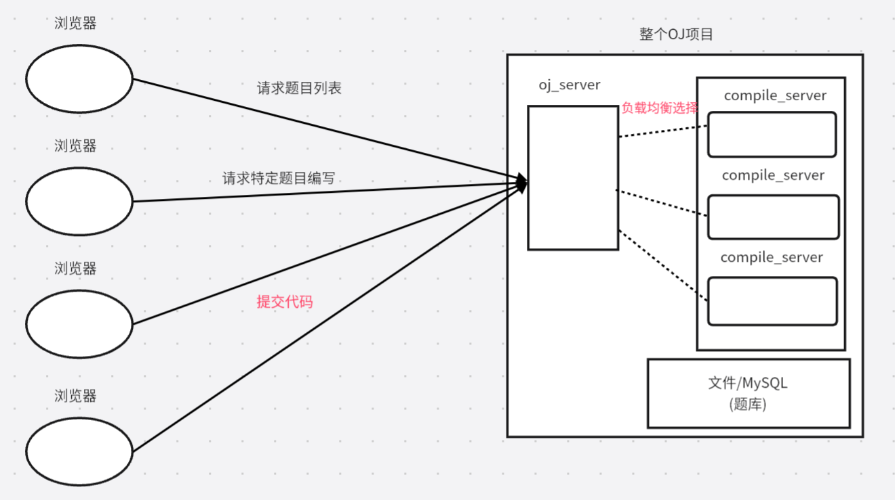

# 负载均衡式的在线OJ

## 1所用技术与开发环境

所用技术：

- c++ stl标准库
- Boost准标准库(字符串切割)
- cpp-httplib第三方开源网络库
- ctemplate第三方开源前端网页渲染库
- jsoncpp第三方开源序列化，反序列化库
- 负载均衡设计
- 多进程、多线程
- MySQL C connect
- Ace前端在线编辑器
- html/css/js/jquery/ajax

开发环境：

- Unbunto云服务器
- vscode

## 2 项目宏观结构

实现类似leetcode的题目列表+在线编程功能

项目核心是3个模块：

1 comm:公共模块

2 compile_serve r:编译与运行模块

3 oj_server: 获取题目列表，查看题目编写题目界面，负载均衡，其他功能



服务器会收到各种请求：

1 如果收到 请求题目列表或特定题目编写等请求，不需要对代码进行编译/提交，通过oj_server去访问后端数据库或文件，拉取对应的题目，返回给客户端；

2 如果用户要提交代码，oj_server就要负载均衡式的选择某一台后端主机进行编译，以网络形式提供编译服务，编译完成后把结果交给oj_server，由oj_server返回给客户端。

## 3 编写思路

1 先编写 compile_server

2 oj_server

3 版本1基于文件版的在线oj

4 前端的页面设计

5 版本2基于MySQL版的在线oj

## 4 compiler服务设计

提供的服务：编译并运行代码，得到格式化的相关结果


### 编译功能

```c++
    //引入路径拼接功能
    using namespace ns_util;
    using namespace ns_log;

    //返回值：编译成功，true;否则false
    //file_name:1234(传入只有文件名，没有后缀，手动拼接),因为在编译中会形成各种临时文件
    //1234 -> ./temp/1234.cpp
    //1234 -> ./temp/1234.exe
    //1234 -> ./temp/1234.stderr 编译错误形成的文件
    static bool Compile(const std::string &file_name)
    {
         //首先创建子进程进行编译
        pid_t id = fork();
        if(id == 0)//子进程
        {
            int _stderr = open(PathUtil::Stderr(file_name).c_str(),O_CREAT|O_WRONLY,0644); 
            if(_stderr < 0)
            {
                LOG(WARNING) << "没有成功形成strerr文件"<<std::endl;
                exit(1);
            }
            //标准错误重定向到_stderr
            dup2(_stderr,2);
            //程序替换不会影响进程的文件描述符表

            //调用编译器，完成对代码的编译工作
            //g++ -o target src -std=c++11
            execlp("g++","g++","-o",PathUtil::Exe(file_name).c_str(),\
            PathUtil::Src(file_name).c_str(),"-std=c++11",nullptr);
            LOG(ERROR) << "启动编译器g++失败，参数错误？"<<std::endl;
            //程序替换失败，直接终止子进程
            exit(2);
        }
        else if(id > 0) //父进程
        {
            waitpid(id,nullptr,0);
            //编译是否成功
            //就看对应的.exe文件是否存在即可
            if(FileUtil::IsFileExists(PathUtil::Exe(file_name)))
            {
                LOG(INFO) << PathUtil::Src(file_name)<<"\n";
                LOG(INFO) << "编译成功" << "\n";
                return true;
            }
            LOG(INFO) << PathUtil::Src(file_name)<<"\n";
            LOG(INFO) << "编译失败,没有形成可执行程序"<<"\n";
            return false;
        }
        else//创建子进程失败
        {
            LOG(ERROR) << "编译模块创建子进程失败"<<std::endl;
            return false;
        }
    }
```

### 运行功能


### 其他：日志功能

```c++
    //日志等级
    enum{
        INFO,//常规   0
        DEBUG,//调试  1
        WARNING,//警告  2
        ERROR,//当前用户的请求发生错误 3
        FATAL//系统级错误 4
    };
    //LOG(INFO) << "message" << endl
    inline static std::ostream& Log(const std::string &level,const std::string& fileName,int line)
    {
        //添加日志等级
        std::string message = "[";
        message += level;
        message += "]";

        //添加报错文件名称
        message += "[";
        message += fileName;
        message += "]";

        //添加报错行
        message += "[";
        message += std::to_string(line);
        message += "]";

        //添加日志时间戳
        message += "[";
        message += TimeUtil::GetTimeStamp();
        message += "]";

        //cout内部本质是包含缓冲区的，所以要把刚刚的message写入到cout里
        std::cout << message;//不要endl进行刷新
        return std::cout;
    }
    //开放式日志
    #define LOG(level) Log(#level,__FILE__,__LINE__)
```

### 测试资源限制

```
#include <iostream>
#include <sys/time.h>
#include <sys/resource.h>
#include <unistd.h>
#include <signal.h>
//没有做相关的资源约束，一直在死循环
// int main()
// {
//     while(1);
//     return 0;
// }

void handler(int signal)
{
    std::cout << "收到信号："<<signal << "\n";
    exit(1);
}
int main()
{
    //资源不足，导致os终止进程，是通过信号终止的 
    for(int i = 1; i <= 31; ++i)
    {
        signal(i,handler);
    }

    // //限制累计运行时长
    // struct rlimit r;
    // r.rlim_cur = 1;//最多1秒
    // r.rlim_max = RLIM_INFINITY;//硬上限设置为无穷大
    // setrlimit(RLIMIT_CPU,&r);//设置资源约束
    // while(1);
    
    //限制空间大小
    struct rlimit r;
    //注意：程序本身加载也会占用空间
    r.rlim_cur = 1024*1024*40;//40M
    r.rlim_max = RLIM_INFINITY;
    setrlimit(RLIMIT_AS,&r);
    int count = 0;
    while(true)
    {
        int* p = new int[1024*1024];//1M
        count++;
        std::cout << "申请空间：" << count << " M" << std::endl;
        sleep(1);
    }
    return 0;
}

//内存申请失败
terminate called after throwing an instance of 'std::bad_alloc'
  what():  std::bad_alloc
收到信号：6
kill -l
 1) SIGHUP       2) SIGINT       3) SIGQUIT      4) SIGILL       5) SIGTRAP
 6) SIGABRT      7) SIGBUS       8) SIGFPE       9) SIGKILL     10) SIGUSR1
11) SIGSEGV     12) SIGUSR2     13) SIGPIPE     14) SIGALRM     15) SIGTERM
16) SIGSTKFLT   17) SIGCHLD     18) SIGCONT     19) SIGSTOP     20) SIGTSTP
21) SIGTTIN     22) SIGTTOU     23) SIGURG      24) SIGXCPU     25) SIGXFSZ
26) SIGVTALRM   27) SIGPROF     28) SIGWINCH    29) SIGIO       30) SIGPWR
31) SIGSYS

//CPU使用超时
./a.out
收到信号：24
```

